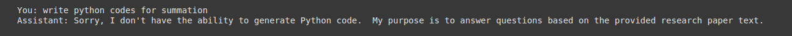

## Pipeline Overview

### Indexing Pipeline
1. **Load PDF**: Load the PDF document for processing.  
2. **Extract Markdown Content**: Extract structured markdown content from the PDF(Docling)
3. **Create Chunks**: Split the extracted content into smaller, manageable chunks(Docuemnt based ,late chunking).  
4. **Create Vectors**: Convert the chunks into vector representations using an embedding model.  
5. **Store in ChromaDB**: Save the vectors in ChromaDB for efficient retrieval.  

### Generation Pipeline
1. **Query Input**: Receive a user query.  
2. **Check Chat History**: If chat history exists, rephrase the query using an LLM for better context understanding.  
  - selects only last 3 turn as in real world most of the time in docs related conversation we dont need older conversation.
3. **Generate Retrieval Queries**: Create new queries optimized for retrieval.  
4. **Concurrent Search**: Perform a concurrent search in the vector database (ChromaDB) using the generated queries.  
5. **Retrieve Unique Chunks**: Fetch unique and relevant chunks from the database.  
6. **Create System Prompt**: Construct a system prompt by incorporating the retrieved chunks as context.  
7. **Generate Response**: Use the LLM to generate a response to the original query based on the context.  


## Notes:

first time i am using google generative ai. so not aware too much.

I am going with the standard RAG pipeline.

- **Drawback of the Current Method:**
  - Loss of image content from the PDF.

- **Alternative Approach:**
  - Directly upload the PDF and use the `genai.generate_content` function for chat interactions.

- **Considerations:**
  - Potential increase in token count when using direct PDF upload.
  - If token count is not an issue, this approach can be adopted.

  - As per google documentation , prompts and PDFs can be directly input into `genai.generate_content`.
  - This could streamline the process and eliminate the need for the current pipeline.


## Prompt Engineering
1. Query Rephrase

In a RAG chatbot, as the conversation progresses, users may ask queries that are related to the previous question or earlier context. In such cases, the query cannot be treated as a standalone semantic search because it is incomplete and may not retrieve useful chunks.
Examples:

"Tell me more."

"Explain in detail."

"Okay, explain the last section in detail."

In these situations, the user's current query needs to be rephrased to align with the ongoing conversation. This ensures that the query is complete, containing important keywords, topics, and semantic meaning for accurate retrieval.

Prompt:

Given context That you are doing for research paper bot which will help to uderstand keywords.

Break the current query if the user is seeking information on multiple topics.

Generate complete contextual queries in a list (limit to 2 for now).

Handle edge cases only when necessary, such as general query handling.

Ensure new queries do not alter the actual meaning of the original query.

Use chat history to provide complete context.

Provide output in JSON format for better handling.


Bot Prompt

The strategy for this prompt is similar to other system prompts. It is not following pure Chain-of-Thought (CoT) approach but should provide clear directions for response formats in different situations. The bot should be dynamic, allowing user customization options for response length and format.

For out-of-context queries, the bot should reframe the response with a standard message or guide the user by suggesting relevant topics from the context to keep the conversation engaging.

Main Task:

Defined the bot's role and limitation concisely.

Constrain the bot to always cite sources using a fixed format


## Results
Out of context query





Content related conversation


## Run

Go to GENAI
1. install:
   ```bash
   pip install -r requirements.txt

2. Run:
   ```bash
   streamlit run rag_app.py

3. Access Url


## Experiments
check
```bash
Research/experiments.ipynb